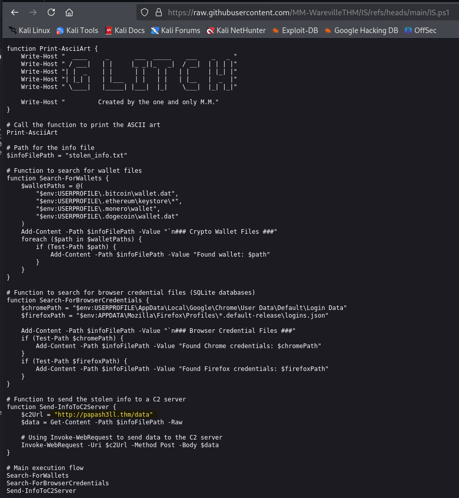
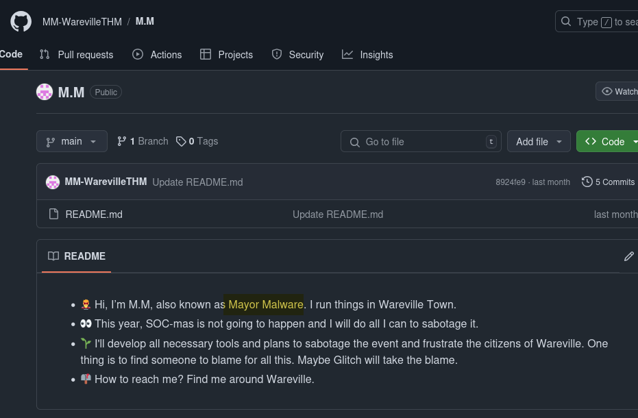
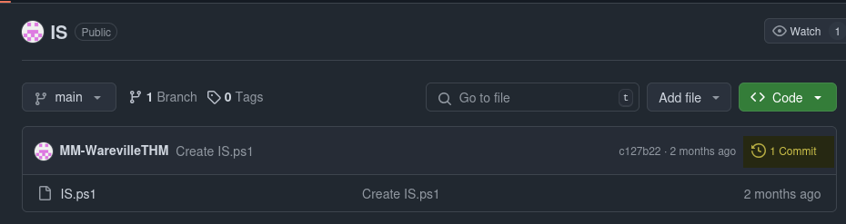

# Answer the questions below

## Looks like the song.mp3 file is not what we expected! Run "exiftool song.mp3" in your terminal to find out the author of the song. Who is the author? 

```sh
┌──(kali㉿kali)-[~/Desktop/01 Day]
└─$ exiftool song.mp3 
ExifTool Version Number         : 13.00
File Name                       : song.mp3
Directory                       : .
File Size                       : 4.6 MB
File Modification Date/Time     : 2024:10:24 09:50:46-04:00
File Access Date/Time           : 2024:12:01 11:26:26-05:00
File Inode Change Date/Time     : 2024:12:01 11:26:13-05:00
File Permissions                : -rwxrwxr-x
File Type                       : MP3
File Type Extension             : mp3
MIME Type                       : audio/mpeg
MPEG Audio Version              : 1
Audio Layer                     : 3
Audio Bitrate                   : 192 kbps
Sample Rate                     : 44100
Channel Mode                    : Stereo
MS Stereo                       : Off
Intensity Stereo                : Off
Copyright Flag                  : False
Original Media                  : False
Emphasis                        : None
ID3 Size                        : 2176
Artist                          : Tyler Ramsbey
Album                           : Rap
Title                           : Mount HackIt
Encoded By                      : Mixcraft 10.5 Recording Studio Build 621
Year                            : 2024
Genre                           : Rock
Track                           : 0/1
Comment                         : 
Date/Time Original              : 2024
Duration                        : 0:03:11 (approx)
```
**Answer:** Tyler Ramsbey

## The malicious PowerShell script sends stolen info to a C2 server. What is the URL of this C2 server?


**Answer:** http://papash3ll.thm/data

## Who is M.M? Maybe his Github profile page would provide clues?



**Answer:** Mayor Malware

## What is the number of commits on the GitHub repo where the issue was raised?



**Answer:** 1

## If you enjoyed this task, feel free to check out the OPSEC room!

## What's with all these GitHub repos? Could they hide something else?