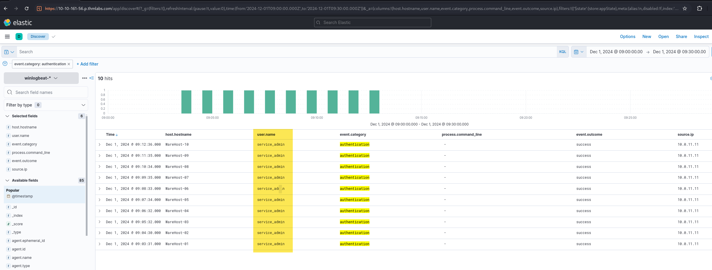
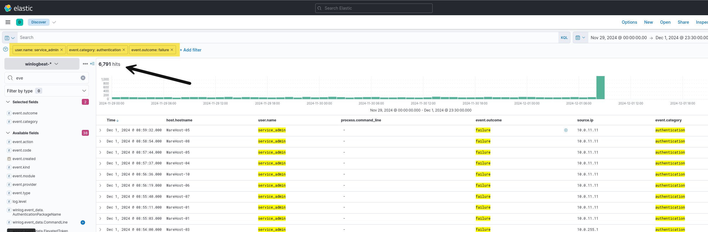
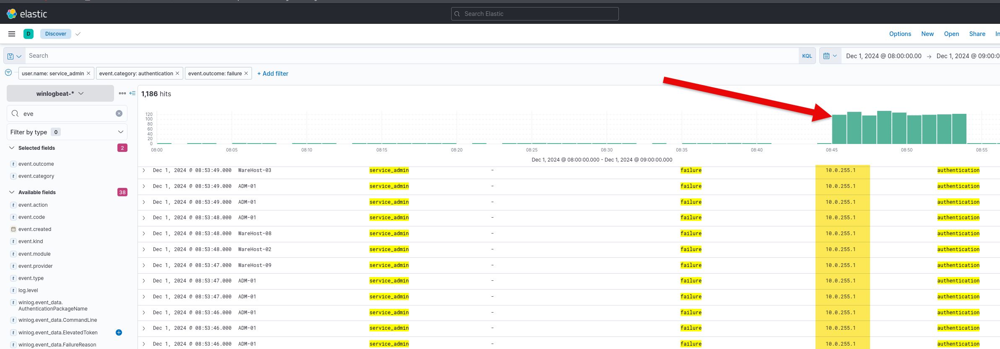
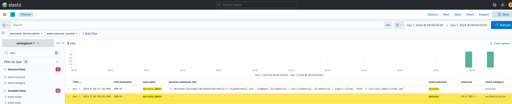
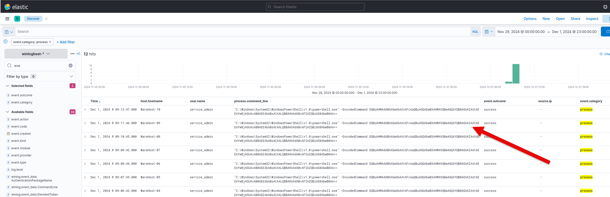
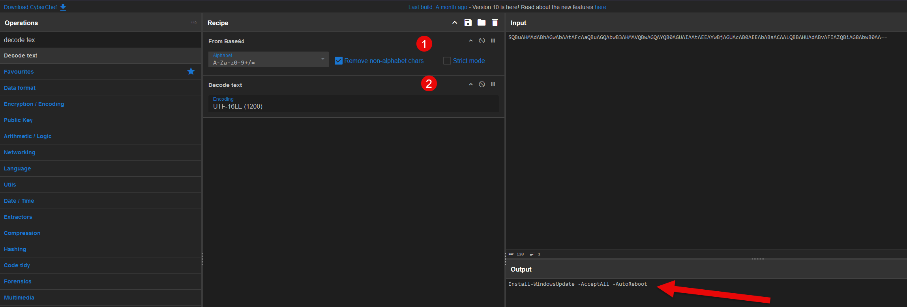

## What is the name of the account causing all the failed login attempts?

**Answer:** service_admin

## How many failed logon attempts were observed?

**Answer:** 6791

## What is the IP address of Glitch?

**Answer:** 10.0.255.1

## When did Glitch successfully logon to ADM-01? Format: MMM D, YYYY HH:MM:SS.SSS

**Answer:** Dec 1, 2024 08:54:39.000

## What is the decoded command executed by Glitch to fix the systems of Wareville?

**Answer:** Install-WindowsUpdate -AcceptAll -AutoReboot