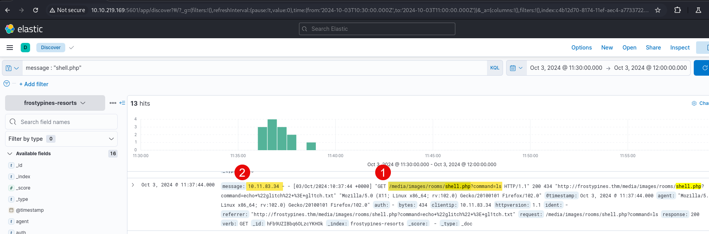
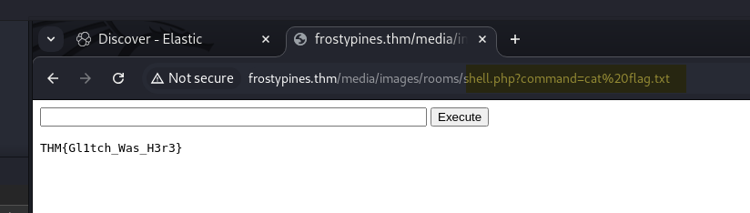

## BLUE: Where was the web shell uploaded to?

Answer format: /directory/directory/directory/filename.php

**Answer:** /media/images/rooms/shell.php

## BLUE: What IP address accessed the web shell?

**Answer:** 10.11.83.34

## RED: What is the contents of the flag.txt?

**Answer:** THM{Gl1tch_Was_H3r3}