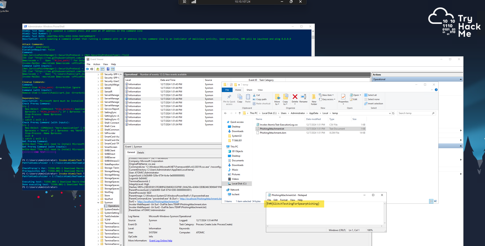
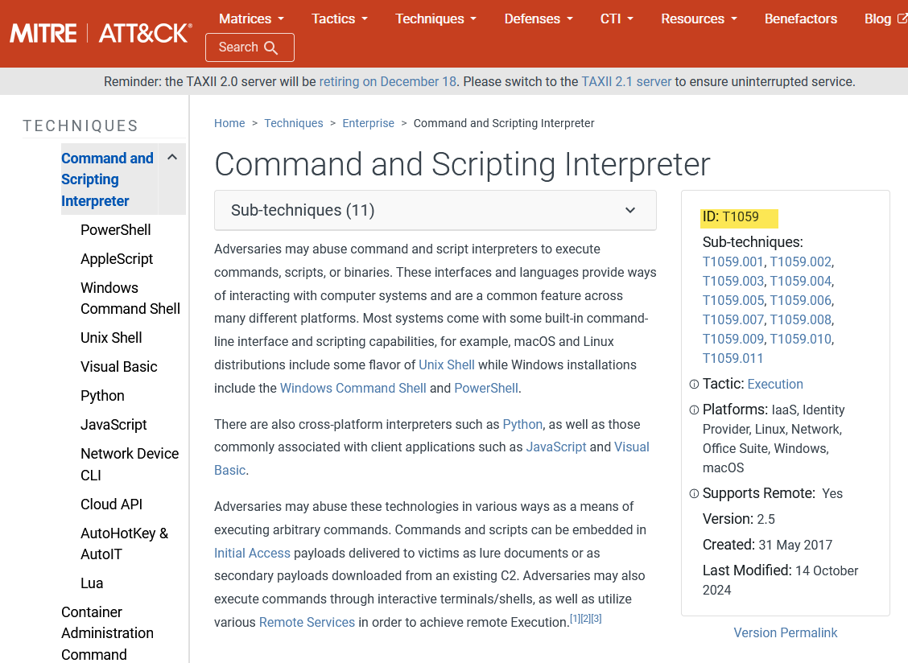
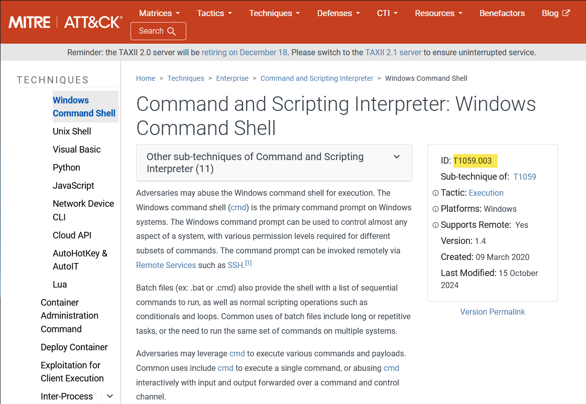
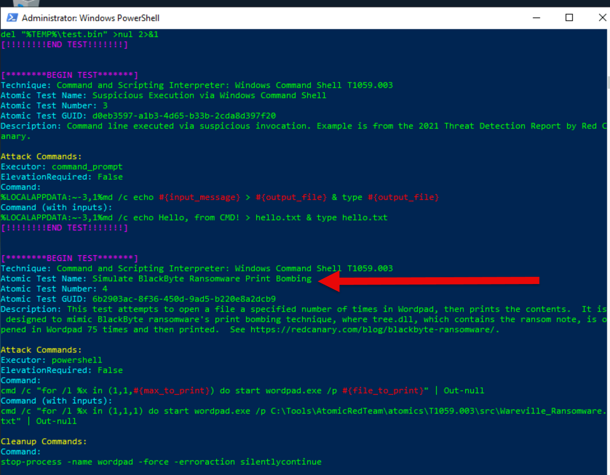
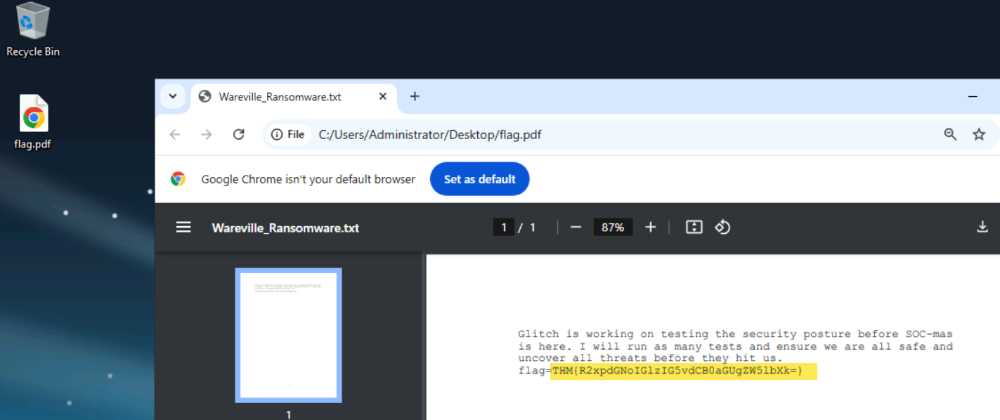

## What was the flag found in the .txt file that is found in the same directory as the PhishingAttachment.xslm artefact?

**Answer:** THM{GlitchTestingForSpearphishing}

## What ATT&CK technique ID would be our point of interest?

**Answer:** T1059

## What ATT&CK subtechnique ID focuses on the Windows Command Shell?

**Answer:** T1059.003

## What is the name of the Atomic Test to be simulated?

**Answer:** Simulate BlackByte Ransomware Print Bombing

## What is the name of the file used in the test?

**Answer:** Wareville_Ransomware.txt

## What is the flag found from this Atomic Test?

**Answer:** THM{R2xpdGNoIGlzIG5vdCB0aGUgZW5lbXk=}

