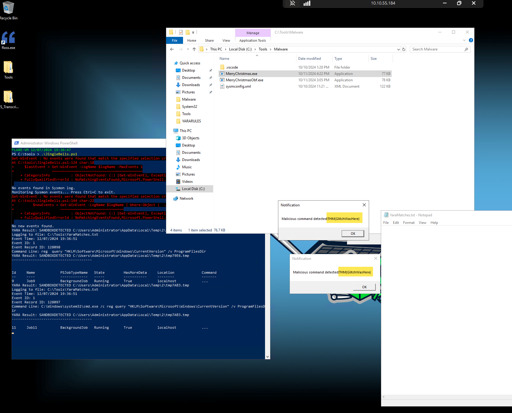
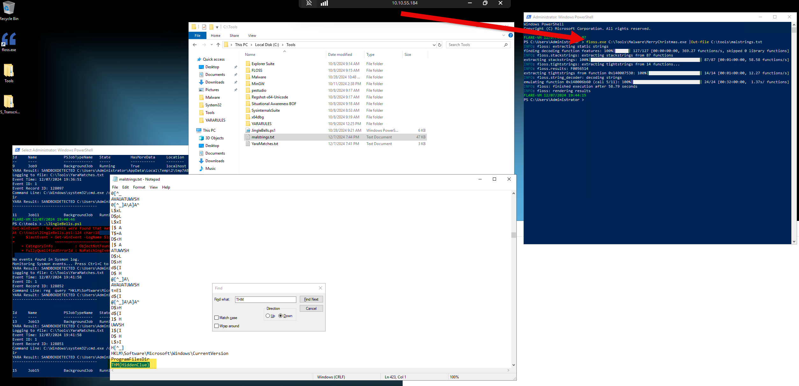

## What is the flag displayed in the popup window after the EDR detects the malware?

**Answer:** THM{GlitchWasHere}

## What is the flag found in the malstrings.txt document after running floss.exe, and opening the file in a text editor?

**Answer:** THM{HiddenClue}