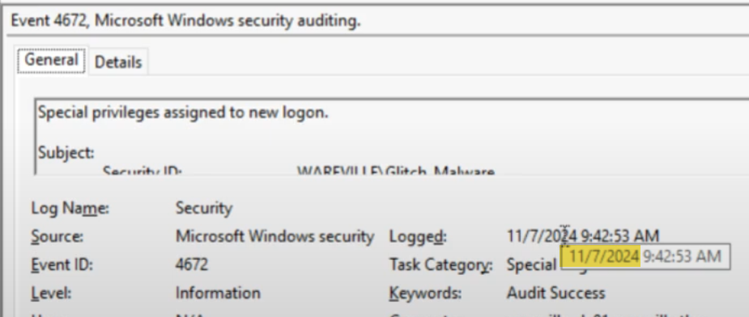
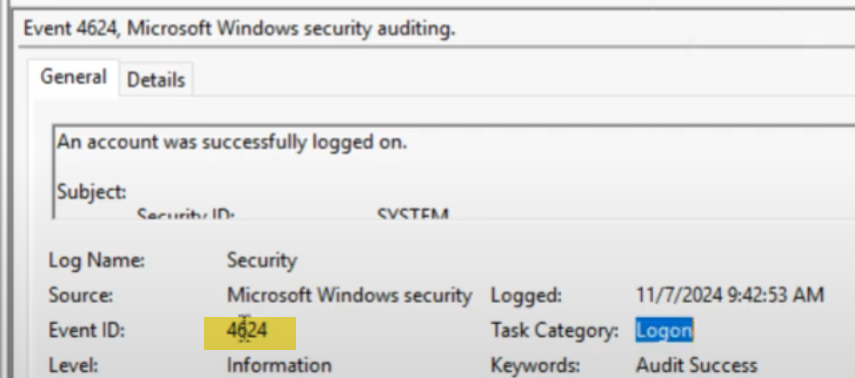
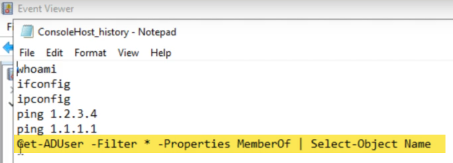
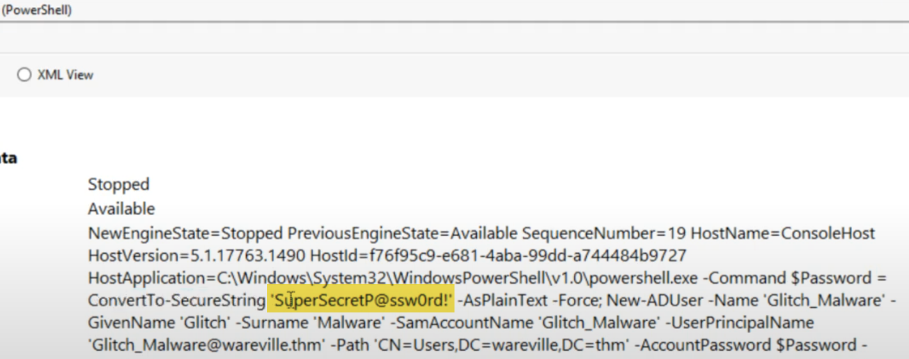
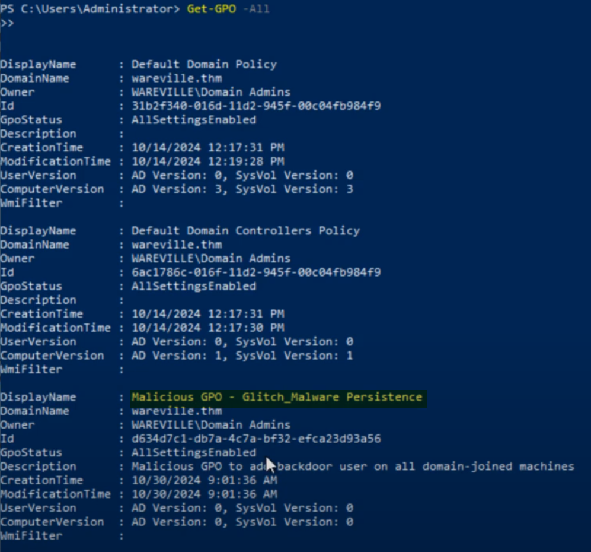

## On what day was Glitch_Malware last logged in?
### Answer format: DD/MM/YYYY

**Answer:** 07/11/2024

## What event ID shows the login of the Glitch_Malware user?

**Answer:** 4624

## Read the PowerShell history of the Administrator account. What was the command that was used to enumerate Active Directory users?

**Answer:** Get -ADUser -Filter * -Properties MemberOf | Select-Object Name

## Look in the PowerShell log file located in Application and Services Logs -> Windows PowerShell. What was Glitch_Malware's set password?

**Answer:** SuperSecretP@ssw0rd!

## Review the Group Policy Objects present on the machine. What is the name of the installed GPO?

**Answer:** Malicious GPO - Glitch_Malware Persistence