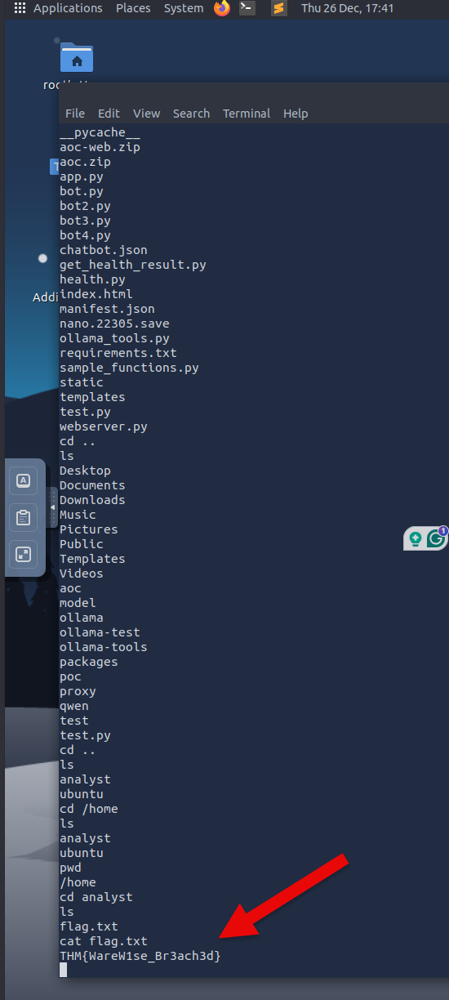

## What is the technical term for a set of rules and instructions given to a chatbot?

**Answer:** system prompt

## What query should we use if we wanted to get the "status" of the health service from the in-house API?

**Answer:** Use the health service with the query: status

## After achieving a reverse shell, look around for a flag.txt. What is the value?

THM{WareW1se_Br3ach3d}