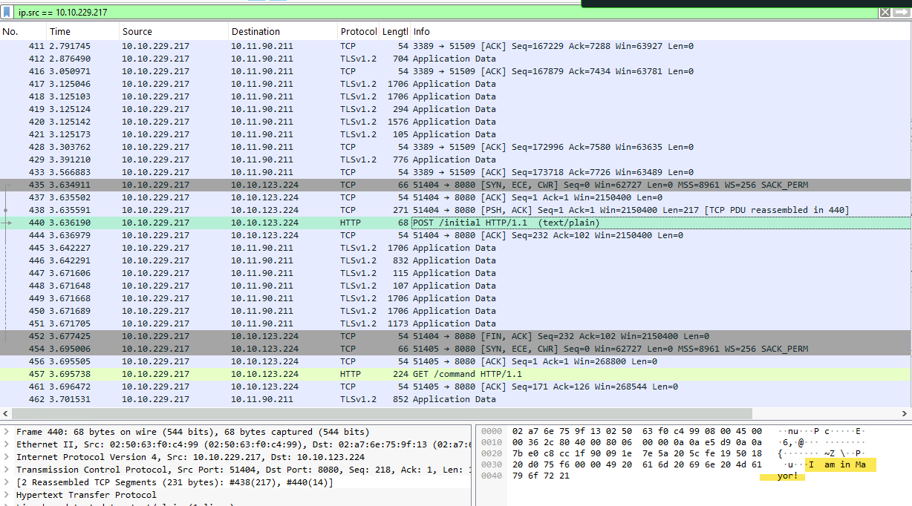
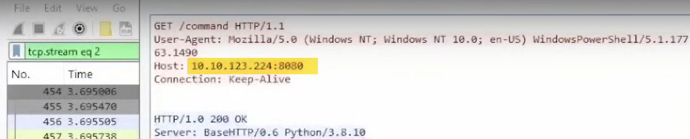
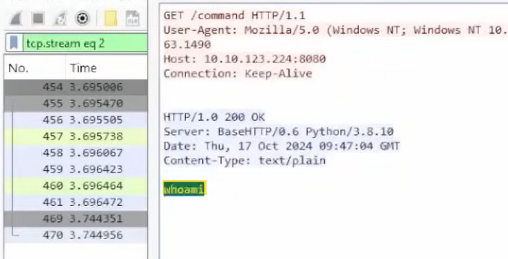
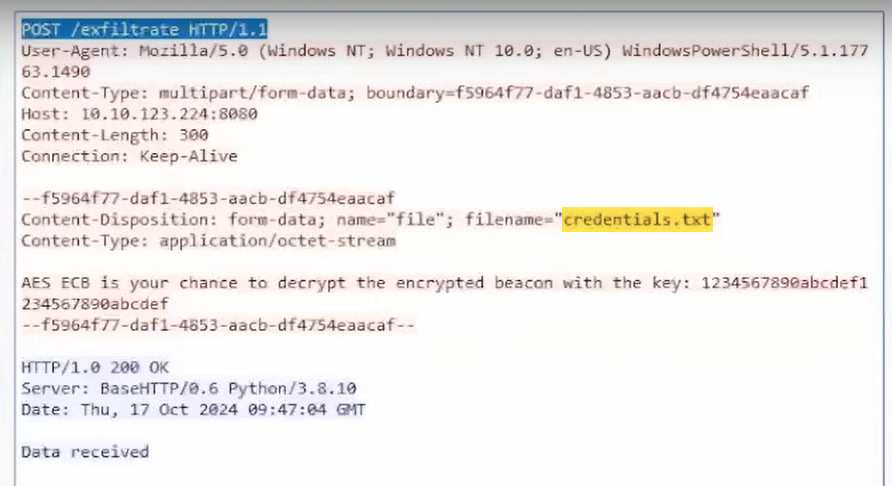
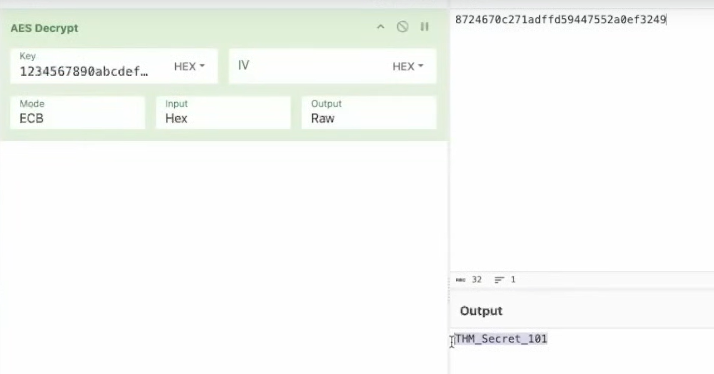

## What was the first message the payload sent to Mayor Malware’s C2?

**Answer:** I am in Mayor!

## What was the IP address of the C2 server?

**Answer:** 10.10.123.224

## What was the command sent by the C2 server to the target machine?

**Answer:** whoami

## What was the filename of the critical file exfiltrated by the C2 server?

**Answer:** credentials.txt

## What secret message was sent back to the C2 in an encrypted format through beacons?

**Answer:** THM_Secret_101

