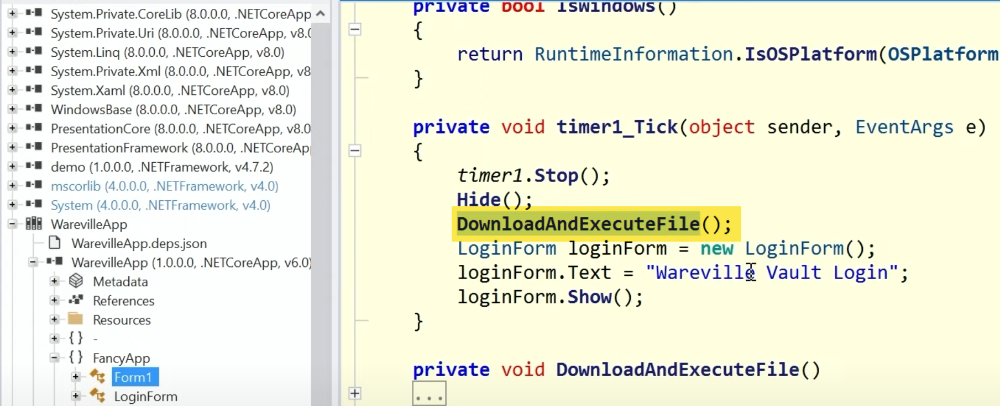
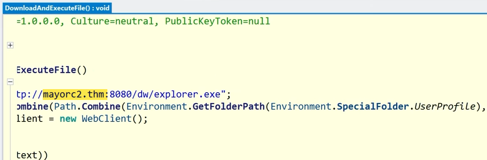
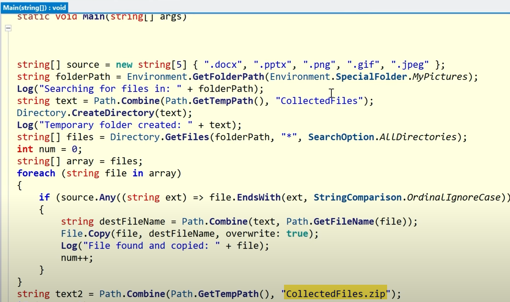
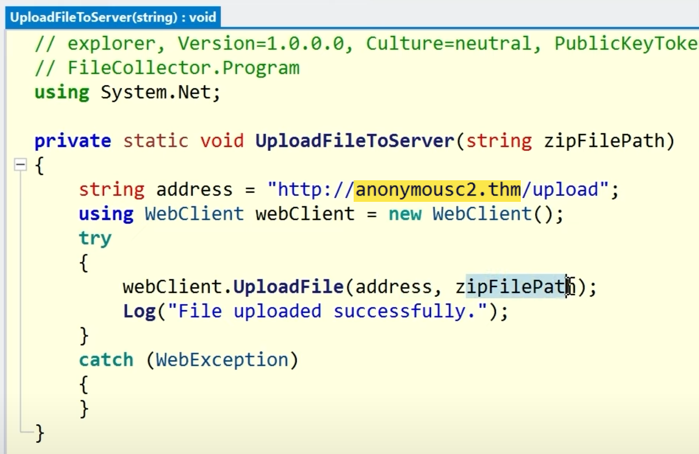

## What is the function name that downloads and executes files in the WarevilleApp.exe?

**Answer:** DownloadAndExecuteFile

## Once you execute the WarevilleApp.exe, it downloads another binary to the Downloads folder. What is the name of the binary?

**Answer:** explorer.exe

## What domain name is the one from where the file is downloaded after running WarevilleApp.exe?

**Answer:** mayorc2.thm

## The stage 2 binary is executed automatically and creates a zip file comprising the victim's computer data; what is the name of the zip file?

**Answer:** CollectedFiles.zip

## What is the name of the C2 server where the stage 2 binary tries to upload files?

**Answer:** anonymousc2.thm
