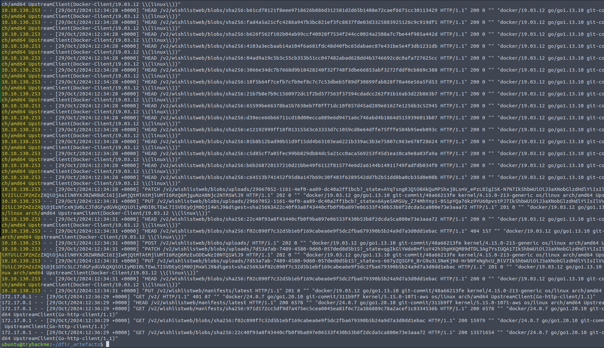

## What is the name of the webshell that was used by Mayor Malware?

**Answer:** shelly.php

## What file did Mayor Malware read from the pod?

**Answer:** db.php

## What tool did Mayor Malware search for that could be used to create a remote connection from the pod?

**Answer:** nc

## What IP connected to the docker registry that was unexpected?

**Answer:** 10.10.130.253

## At what time is the first connection made from this IP to the docker registry?

**Answer:** 29/Oct/2024:10:06:33 +0000

## At what time is the updated malicious image pushed to the registry?

**Answer:** 29/Oct/2024:12:34:28 +0000

## What is the value stored in the "pull-creds" secret?

**Answer:** {"auths":{"http://docker-registry.nicetown.loc:5000":{"username":"mr.nice","password":"Mr.N4ughty","auth":"bXIubmljZTpNci5ONHVnaHR5"}}}